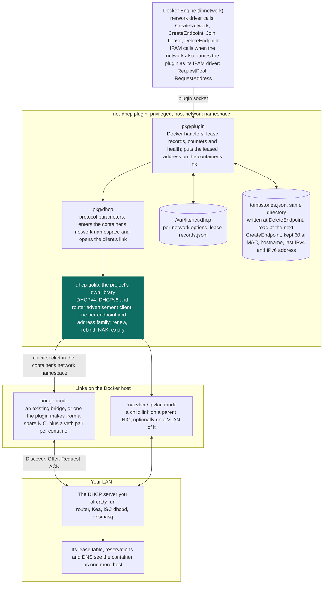

# Architecture

The plugin sits between the Docker Engine and the DHCP server you already
run. The diagram names the parts and what passes between them.

Docker calls the plugin over its socket; `pkg/plugin` answers Docker and
keeps the records and tombstones, `pkg/dhcp` enters the container's
network namespace, and the library speaks DHCP over the container's own
link to the server on your LAN. The DHCP client is
[claymore666/dhcp-golib](https://github.com/claymore666/dhcp-golib), this
project's own library, pinned in `go.mod`.

It is a privileged plugin: it runs with host networking, the Docker socket
and `CAP_NET_ADMIN`. The full list is under [Requirements](index.md#requirements),
and what each item is for is in [SECURITY.md](https://github.com/claymore666/docker-net-dhcp/blob/main/SECURITY.md#scope--what-this-plugin-is).
The call sequence behind the arrows is in [How it works](internals.md).
