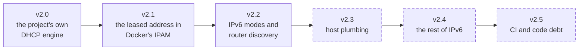

# Roadmap

Where `docker-net-dhcp` is going over roughly the next year, and, the
more useful half, where it deliberately is not going.

This page is direction, not a delivery schedule. The project is
solo-maintained, so nothing here carries a date. The milestone links
below decide what is in a release; this page follows them.

## Open milestones

| Release | Theme | Milestone |
| --- | --- | --- |
| v2.2.3 | The default route at the first lease, a renumber inside one subnet, on-link routes after Join, a persistent client on a late link, and the tests and gates listed below | [milestone 37](https://github.com/claymore666/docker-net-dhcp/milestone/37) |
| v2.3.0 | The host plumbing an operator does by hand today, and the gaps the IPAM shape still refuses | [milestone 31](https://github.com/claymore666/docker-net-dhcp/milestone/31) |
| v2.4.0 | The rest of IPv6, and the DHCP options the client does not read yet | [milestone 34](https://github.com/claymore666/docker-net-dhcp/milestone/34) |
| v2.5.0 | CI consolidation and code debt; nothing a user sees | [milestone 35](https://github.com/claymore666/docker-net-dhcp/milestone/35) |

### v2.2.3

- [#1084], the first lease adds the default route the engine is about to
  program, and the container fails to start
- [#1081], a renumber inside one subnet leaves the container with no IPv4
  address on a host with `promote_secondaries=0`
- [#1065], IPv6 is prepared on a link name the engine has already changed
- [#1044], an endpoint entry can read `lease_state=bound` with no
  `last_event`
- [#1016], an integration test for the v2.2.0 behaviours that only a unit
  test drives
- [#1015], an engine-matrix step for every documented option
- [#866], tests under `test/integration/harness/` run nowhere and nothing
  says so
- [#883], a gate counts a mention as an invocation, so an unwired gate
  reports as wired
- [#888], a gate resolves symbols at git HEAD, so an uncommitted rewrite
  is never judged
- [#1042], the coverage-presence wait is shorter than recent coverage runs
- [#1043], the Docker Hub alias signature is verified before the registry
  serves the copied referrers
- [#1056], the comment volume in the Go tree, and a gate on added comments
- [#1088], an IPv6 on-link prefix route is installed only from the Join
  answer, never from a later router advertisement
- [#1089], the persistent DHCPv4 client can open before the engine sets
  the link up and then never binds, although the server acknowledges
  every request

### v2.3.0

- [#902], a `vlan` option that puts the network on a tagged VLAN off the
  parent
- [#903], a bridge the plugin creates and owns
- [#904], link-local fallback where no server answers, off by default
- [#905], macvlan and ipvlan sub-mode options
- [#949], ipvlan in IPAM mode, keyed on the MAC Docker generates for the
  endpoint
- [#960], IPv6 in IPAM mode: the v6 exchange, the v6 record, and a DUID
  that survives a restart
- [#1029], the DHCPv6 Client FQDN option, so `register_dns` registers the
  AAAA record beside the A
- [#1036], a `require_mac` option that refuses an endpoint with no
  Docker-supplied MAC
- [#1037], an `mtu` option that sets the endpoint link MTU explicitly
- [#1045], the code-scanning result is not a required check on either
  protected branch

### v2.4.0

- [#1027], IPv6-Only Preferred, DHCPv4 option 108
- [#1028], PREF64 from the Router Advertisement, the NAT64 prefix
- [#1030], Microsoft classless static routes, option 249, where 121 is
  absent
- [#1031], DHCPv4 Rapid Commit
- [#1032], `ipv6_iid=stable-privacy`, the RFC 7217 interface identifier,
  with modified EUI-64 kept as the default
- [#1033], the DHCPv6 timezone options logged as the v4 ones are
- [#1034], the vendor-specific options logged
- [#1038], a network with no DHCPv6 server remembered for a bounded time,
  so a SLAAC-only segment stops paying a full solicitation per attach
- [#926], DHCPv6 Rapid Commit, the two-message exchange
- [#927], DHCPv6 temporary addresses (IA_TA)
- [#214], DHCPv6 prefix delegation (IA_PD), designed first
- [#859], the whole DHCPv6 NTP server list
- [#1035], one multi-architecture manifest list per tag, which also
  settles the arm64 claim in the table below

### v2.5.0

- [#733], the tracking issue for the CI consolidation programme
- [#744], one subject discovery, one refusal and one collation in a
  shared shell library
- [#745], six gates merged, and one proved removable
- [#746], the four integration lanes reduced to one reusable workflow
- [#747], four detectors modelling one vendor scheduler collapsed into
  one
- [#748], the process tier trimmed and frozen until there is a second
  maintainer
- [#749], gate expiry, the premise rule turned on the gates themselves
- [#798], a publisher outside the standard build-and-push shape is
  dropped from a gate's population
- [#799], nothing observes the release runbook against the release
  workflow
- [#856], nothing checks the release notes' breaking-change table against
  the code
- [#861], nothing checks that a Go comment still describes its code
- [#886], the canonical runner-pool facts are never compared to the live
  runner count
- [#680], a host AppArmor profile silently disables the kea fixture
- [#690], what each capability in `config.json` buys, measured by a
  matrix job
- [#657], the netlink seam enforced, so the endpoint paths can be
  unit-tested
- [#674], what a version number promises, written down
- [#178], the frozen `docker/docker` module replaced by the ones moby
  publishes

## The release line

v2.0, v2.1 and v2.2 are released, and v2.3, v2.4 and v2.5 are planned in
that order; the planned ones are the dashed nodes. There are no dates, and
the patch releases on each line are on the milestone links above.

## The bar every feature is measured against

One `docker network create` line, then plain `networks: [lan-dhcp]` in
any Compose file. No static IPs, no sidecars, no per-container plumbing,
no entrypoint script that has to know it is running on this network.

That bar decides most design arguments before they start. A workaround a
user has to script around the plugin is read here as a bug report against
this principle. [#125] is the worked example: containers landed on
`eth0`, `eth1` and so on in attach order, users scripted around the name,
and the plugin now returns the requested interface name to the engine.

## Where the project is today

This branch is the 2.x line. The plugin leases through the project's own
in-tree DHCP client library, for IPv4 and IPv6, over bridge, macvlan and
ipvlan, and serves Docker's IPAM contract as well as its network driver
contract.

The [driver reference](reference.md) is the authority on what exists and
what each option does, and
[the release notes](https://github.com/claymore666/docker-net-dhcp/blob/main/RELEASE_NOTES.md)
are the record of what each tag changed. Where this page disagrees with
either of them, this page is wrong.

## Direction

Themes, in rough order of how much they change for a user. The issue
numbers are anchors; the order is not a queue.

| Theme | State | Anchors |
| --- | --- | --- |
| Quiet addressing faults | RFC 5227 conflict detection runs inside the container's namespace for the life of the lease; every new failure mode gets a counter as well as a log line | [#524] |
| Lease identity across recreates | the DHCPv6 half shipped with 2.0; the deterministic MAC is blocked upstream and the ipvlan client-id carries no milestone | [#218], [#219], [#895] |
| arm64 | a native arm64 runner executes the full integration suite as a release-candidate gate, and the shipping shape is per-architecture tags | [#507], [#531] |
| A test substrate that cannot lie | a test that only passes once something is weakened is treated as a bug report, and a gate enforces it | [#403] |
| Supply chain and documentation | releases are signed, provenanced, SBOM'd and reproducible; the remaining pull is the OpenSSF silver and gold criteria | [#452] |

The reasoning behind each theme

**Quiet addressing faults.** The hard failures were solved first; the
quiet ones are the current work. v1.6.0 added conflict detection ([#524])
because the plugin accepted an address a statically-configured host
already held and every counter stayed at zero. The container came up,
Docker reported an address, and nothing anywhere said otherwise. 2.0
moved the check off the parent link and into the DHCP client, as RFC 5227
Address Conflict Detection running inside the container's own namespace
for the whole life of the lease, with
[`conflict_check`](reference.md#driver-options-network-level) choosing who
pays for it. A counter that can read clean while the feature is broken is
treated as an unfinished instrument.

**Lease identity across recreates.** A DHCP server keys on identity, so
address stability is an identity problem. [#218], the deterministic MAC,
is backlog and blocked upstream. [#219], a stable client-id for ipvlan
where every child shares the parent's MAC, carries no milestone. 2.0
settled the DHCPv6 half: an ipvlan endpoint now gets a DUID of its own
([#895]).

**arm64.** Users asked for it and it works, proven on real hardware
([#531]). Per-architecture tags (`vX.Y.Z-arm64`, `latest-arm64`) were
first published with v1.7.0 ([#507]). This page long held that a Docker
plugin cannot be installed from a multi-architecture manifest list at
all, so the architecture lives in the tag. That claim is contested by a
registry that serves one, and [#1035] measures it.

**A test substrate that cannot lie.** This is infrastructure work with a
user-visible reason: on this project, every timing crutch removed from CI
turned out to be hiding a real defect. An opt-out helper added to make a
restart test pass hid a user-facing `docker restart` failure for months.
The question a loaded host raised, whether a slow Join leaves a container
without a renewal client, was answered in 2.2 by making the attach path
readable: every attach that completes is timed, and those durations with
the namespace gauges say how close a host runs to its budget ([#403]).

**Supply chain and documentation.** The OpenSSF criteria are tracked as
ordinary issues and generally translate into something concrete. This
page exists because `documentation_roadmap` is one of them ([#452]).

## Blocked upstream

One feature is designed here and cannot ship until Docker's own engine
carries a change. It stays open on purpose:

| Here | Needs | Upstream |
| --- | --- | --- |
| [#218], the deterministic MAC | network drivers to receive the endpoint name at `CreateEndpoint`, as IPAM drivers already do | [moby/moby#52870] (issue), [moby/moby#52871] (PR, open) |

Both halves were filed in June 2026. The endpoint-name change
([moby/moby#52871]) is still awaiting review, and [#218] will not be
closed as "won't fix" while that is the only thing in the way. This
fork's own half is written and waiting.

The second upstream dependency has moved. The `interface_name`
pass-through ([moby/moby#52866]) merged and shipped in moby engine
29.8.0, and [#125] closed with it. Engines below that boundary ignore a
remote driver's requested interface name, the integration lane runs
29.8.0, and the plugin counts `ifname_unsupported` below it.

## Out of scope

These are decided, and the reasoning is recorded so a contributor can
read it before writing the PR.

| Decision | Reason | Anchor |
| --- | --- | --- |
| It will not become a DHCP server | your existing server is the authority; a second one would recreate the problem the plugin solves | [#111] |
| It will not change interfaces the host already has | the plugin reads host configuration and does not own it | [#903] |
| It will not gain a static-IP workflow | an address that must be fixed is fixed where addresses are decided, in a reservation on the DHCP server | n/a |
| It will not ask for more privileges to buy a feature | a capability added to `config.json` forces every operator to re-approve the plugin on upgrade | [#725] |
| It will not detect a conflicting container on the same host | RFC 5227 runs on the container's own link, and macvlan parent and child isolation hides a sibling that has taken our address | [#528] |
| It will not support ipvlan L3 or L3S | DHCP needs L2 broadcast | n/a |
| It will not run its arm64 verification under qemu-user or binfmt | measured: the emulated plugin could not acquire a lease at all, and arm64 verification runs on real hardware | [#531] |
| It will not backport security fixes | only the latest release is supported, and upgrading is one `docker plugin install` | [SECURITY.md](https://github.com/claymore666/docker-net-dhcp/blob/main/SECURITY.md) |
| It will not carry AI-assistant attribution in its history | commits and PRs are signed by a person who stands behind them, and a CI check enforces it | n/a |

The reasoning behind the refusals

**A second DHCP server.** No lease serving, no built-in pool, no failover
of its own. Interoperating with more than one server is a different
question, and v1.8.0 answered it: `dhcp_servers` and `dhcp_deny_servers`
decide which existing server a network leases from ([#111]). That stays
on this side of the line: the plugin picks among authorities and never
becomes one.

**Host interfaces.** Bridge mode today needs a bridge you maintain, and
the parent-attached modes will not bring a NIC up, add an address, or
edit netplan or `systemd-networkd`. A bridge the plugin creates for its
own networks and owns for as long as they exist ([#903], v2.3.0) is
inside this rule.

**Static IPs.** A per-container static-IP option would be a second,
silently conflicting IPAM.

**Privileges.** Adding a capability to
[`config.json`](https://github.com/claymore666/docker-net-dhcp/blob/main/config.json)
forces every operator to re-approve the plugin's privileges on upgrade,
and refusing that trade is the standing answer.

2.0 is what this rule costs when it is met head-on. The 2.0 line does add
`CAP_NET_RAW` to `config.json`, and every operator upgrading onto it
re-approves. It buys no feature: the DHCP exchange runs on an interface
with no address, which requires an `AF_PACKET` socket on the ordinary
path for every endpoint, with no configuration in which the plugin works
without it. The power is unchanged, because the capability is in the OCI
default set and the process always held it, so what the line bought is an
honest manifest and what it cost is the prompt. Read the rule as written:
never add one to buy a feature, and pay the re-approval out loud when the
plugin genuinely needs the grant it is already exercising. See [#725],
whose title says the capability is already granted, which is true of the
effective set the process runs with.

**A conflicting container on the same host.** macvlan's parent and child
isolation, the same property that keeps a sibling from disturbing us,
also hides a sibling that has taken our address. That is excluded by
construction and is not pending work ([#528]).

**Emulated arm64.** On the 1.x client, which opened a `NETLINK_GENERIC`
socket qemu-user does not translate, the emulated plugin could not
acquire a lease at all. The 2.0 client is a different program and has not
been re-measured under emulation; the conclusion is unchanged either way,
because arm64 verification runs on real hardware and there is nothing to
be gained by finding out which syscall the emulator drops next.

## How this page is kept honest

The release runbook makes a top-to-bottom documentation review a release
step, and this page is part of it. The milestone table and the lists
under it are re-read against the tracker there. If a theme above has gone
a year without motion, or a refusal has quietly become something the
project does, that review is where it gets corrected.

[#111]: https://github.com/claymore666/docker-net-dhcp/issues/111
[#125]: https://github.com/claymore666/docker-net-dhcp/issues/125
[#178]: https://github.com/claymore666/docker-net-dhcp/issues/178
[#214]: https://github.com/claymore666/docker-net-dhcp/issues/214
[#218]: https://github.com/claymore666/docker-net-dhcp/issues/218
[#219]: https://github.com/claymore666/docker-net-dhcp/issues/219
[#403]: https://github.com/claymore666/docker-net-dhcp/issues/403
[#452]: https://github.com/claymore666/docker-net-dhcp/issues/452
[#507]: https://github.com/claymore666/docker-net-dhcp/issues/507
[#524]: https://github.com/claymore666/docker-net-dhcp/issues/524
[#528]: https://github.com/claymore666/docker-net-dhcp/issues/528
[#531]: https://github.com/claymore666/docker-net-dhcp/issues/531
[#657]: https://github.com/claymore666/docker-net-dhcp/issues/657
[#674]: https://github.com/claymore666/docker-net-dhcp/issues/674
[#680]: https://github.com/claymore666/docker-net-dhcp/issues/680
[#690]: https://github.com/claymore666/docker-net-dhcp/issues/690
[#725]: https://github.com/claymore666/docker-net-dhcp/issues/725
[#733]: https://github.com/claymore666/docker-net-dhcp/issues/733
[#744]: https://github.com/claymore666/docker-net-dhcp/issues/744
[#745]: https://github.com/claymore666/docker-net-dhcp/issues/745
[#746]: https://github.com/claymore666/docker-net-dhcp/issues/746
[#747]: https://github.com/claymore666/docker-net-dhcp/issues/747
[#748]: https://github.com/claymore666/docker-net-dhcp/issues/748
[#749]: https://github.com/claymore666/docker-net-dhcp/issues/749
[#798]: https://github.com/claymore666/docker-net-dhcp/issues/798
[#799]: https://github.com/claymore666/docker-net-dhcp/issues/799
[#856]: https://github.com/claymore666/docker-net-dhcp/issues/856
[#859]: https://github.com/claymore666/docker-net-dhcp/issues/859
[#861]: https://github.com/claymore666/docker-net-dhcp/issues/861
[#866]: https://github.com/claymore666/docker-net-dhcp/issues/866
[#883]: https://github.com/claymore666/docker-net-dhcp/issues/883
[#886]: https://github.com/claymore666/docker-net-dhcp/issues/886
[#888]: https://github.com/claymore666/docker-net-dhcp/issues/888
[#895]: https://github.com/claymore666/docker-net-dhcp/issues/895
[#902]: https://github.com/claymore666/docker-net-dhcp/issues/902
[#903]: https://github.com/claymore666/docker-net-dhcp/issues/903
[#904]: https://github.com/claymore666/docker-net-dhcp/issues/904
[#905]: https://github.com/claymore666/docker-net-dhcp/issues/905
[#926]: https://github.com/claymore666/docker-net-dhcp/issues/926
[#927]: https://github.com/claymore666/docker-net-dhcp/issues/927
[#949]: https://github.com/claymore666/docker-net-dhcp/issues/949
[#960]: https://github.com/claymore666/docker-net-dhcp/issues/960
[#1015]: https://github.com/claymore666/docker-net-dhcp/issues/1015
[#1016]: https://github.com/claymore666/docker-net-dhcp/issues/1016
[#1027]: https://github.com/claymore666/docker-net-dhcp/issues/1027
[#1028]: https://github.com/claymore666/docker-net-dhcp/issues/1028
[#1029]: https://github.com/claymore666/docker-net-dhcp/issues/1029
[#1030]: https://github.com/claymore666/docker-net-dhcp/issues/1030
[#1031]: https://github.com/claymore666/docker-net-dhcp/issues/1031
[#1032]: https://github.com/claymore666/docker-net-dhcp/issues/1032
[#1033]: https://github.com/claymore666/docker-net-dhcp/issues/1033
[#1034]: https://github.com/claymore666/docker-net-dhcp/issues/1034
[#1035]: https://github.com/claymore666/docker-net-dhcp/issues/1035
[#1036]: https://github.com/claymore666/docker-net-dhcp/issues/1036
[#1037]: https://github.com/claymore666/docker-net-dhcp/issues/1037
[#1038]: https://github.com/claymore666/docker-net-dhcp/issues/1038
[#1042]: https://github.com/claymore666/docker-net-dhcp/issues/1042
[#1043]: https://github.com/claymore666/docker-net-dhcp/issues/1043
[#1044]: https://github.com/claymore666/docker-net-dhcp/issues/1044
[#1045]: https://github.com/claymore666/docker-net-dhcp/issues/1045
[#1056]: https://github.com/claymore666/docker-net-dhcp/issues/1056
[#1065]: https://github.com/claymore666/docker-net-dhcp/issues/1065
[#1081]: https://github.com/claymore666/docker-net-dhcp/issues/1081
[#1084]: https://github.com/claymore666/docker-net-dhcp/issues/1084
[#1088]: https://github.com/claymore666/docker-net-dhcp/issues/1088
[#1089]: https://github.com/claymore666/docker-net-dhcp/issues/1089
[moby/moby#52866]: https://github.com/moby/moby/pull/52866
[moby/moby#52870]: https://github.com/moby/moby/issues/52870
[moby/moby#52871]: https://github.com/moby/moby/pull/52871
