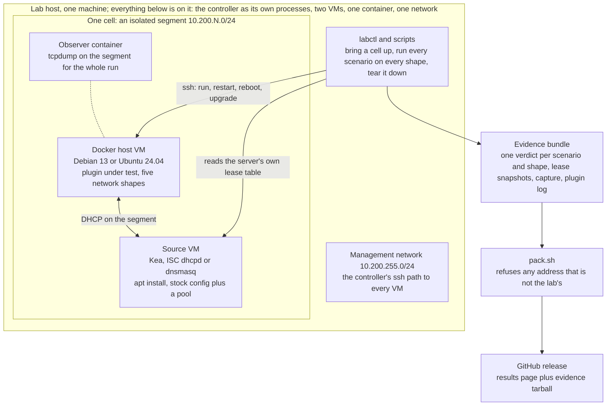

# How this plugin is tested

This plugin gives Docker containers addresses leased from the network's
own DHCP server, in bridge, macvlan and ipvlan mode. A defect here leaves
a container with no address, or with somebody else's, so most of the
testing installs the plugin into a real Docker engine and runs it against
a real DHCP server. This page lists what is tested, where it runs, and
what each result does and does not prove. How to run the unit tests, the
integration suite and the load matrix yourself is in
[Running the tests](internals.md#running-the-tests); the other parts run
only in the workflows linked below.

## Unit tests and static analysis
- The [Test workflow](https://github.com/claymore666/docker-net-dhcp/blob/main/.github/workflows/test.yaml)
  runs the Go unit tests with the race detector, four fuzz targets on a
  fixed execution budget, `staticcheck` and `govulncheck`, on every pull
  request and push into `dev` and `main`, and once a week.
- Proves: the code builds and each package behaves as its tests say.
- Limits: no engine runs and no DHCP packet is sent.

## Integration suite
- The [Integration workflow](https://github.com/claymore666/docker-net-dhcp/blob/main/.github/workflows/integration.yml)
  installs the plugin into a real Docker engine and runs it against a real
  DHCP server (dnsmasq, and Kea for some tests) on isolated virtual links
  in bridge, macvlan and ipvlan
  mode, plus a failure suite, on the project's own amd64 runners on every
  push and pull request into `dev` and `main`.
- Proves: the plugin works end to end against a real DHCP server on the
  engine those runners carry, named under
  [Requirements](index.md#requirements) in the README.
- Limits: one engine version, one kind of hardware, no physical network.

## Engine matrix
- The [Engine matrix](https://github.com/claymore666/docker-net-dhcp/blob/main/.github/workflows/engine-matrix.yml)
  drives the baseline (plugin enabled, a network in each mode, a lease in
  the DHCP server's log, an address kept across `docker restart`) on every
  line in [`engine-rows.txt`](https://github.com/claymore666/docker-net-dhcp/blob/main/.github/engine-rows.txt),
  20.10 to the current release plus 19.03, weekly and on every change to
  the measurement.
- Proves: the baseline holds on each supported engine line; 19.03 is
  `unsupported` because it is unmeasured.
- Limits: the baseline only, not the whole suite; the plugin is built
  locally, never pulled from a registry.

## arm64 on a Raspberry Pi 4
- The [integration-arm64 workflow](https://github.com/claymore666/docker-net-dhcp/blob/main/.github/workflows/integration-arm64.yml)
  runs the integration suite on a netbooted Raspberry Pi 4, a real arm64
  kernel, for every release candidate tag; if the Pi is offline the check
  fails instead of waiting.
- Proves: the release candidate passes the suite on arm64.
- Limits: one machine and one kernel; ordinary pushes do not reach it.

## Hosted cross-check
- The [hosted cross-check](https://github.com/claymore666/docker-net-dhcp/blob/main/.github/workflows/integration-hosted.yml)
  runs the integration suite on GitHub's own runners weekly and on demand.
- Proves: a green suite does not depend on the project's own hardware.
- Limits: it runs weekly, so a failure points at a week of changes, not
  at one.

## Load on a small host
- [`scripts/vm-load-test.sh`](https://github.com/claymore666/docker-net-dhcp/blob/main/scripts/vm-load-test.sh)
  builds a throwaway 2 vCPU, 2 GB VM with the engine, this tree's plugin
  and a dnsmasq server, starts bursts of 10, 20 and 50 containers at idle
  and under three levels of pressure, and prints the attach counters
  beside the DHCP server's lease file (defined in [#969](https://github.com/claymore666/docker-net-dhcp/issues/969),
  [detail](internals.md#the-attach-budget-under-load)).
- Proves: what a small, loaded host does at attach time; each run prints
  its own table.
- Limits: run by hand, not part of CI; a load measurement varies from
  run to run.

## Release verification
- The [Release workflow](https://github.com/claymore666/docker-net-dhcp/blob/main/.github/workflows/release.yml)
  signs each image and release artifact with cosign, attests provenance
  for the GHCR image and the release artifacts, then installs the plugin
  from GHCR and
  Docker Hub on hosted amd64 and arm64 runners and checks that it enables.
  [Verifying releases](verifying-releases.md) shows how to repeat the
  signature and provenance checks yourself.
- Proves: both registries hold a signed plugin that installs and enables
  on both architectures.
- Limits: the install jobs create no network and lease no address; the
  provenance attestation covers the GHCR image, not the Docker Hub copy.

## Real-server lab
- [docker-net-dhcp-lab](https://github.com/claymore666/docker-net-dhcp-lab)
  installs a release candidate into a real Docker engine on its own VM and
  leases from a stock DHCP server on a second VM, one isolated cell per
  server. Every scenario is judged against the server's own lease table,
  never against the plugin's report.

A cell is a DHCP server and a Docker host on their own segment; the
controller runs every scenario on every shape, judges each one against
the server's lease table, and everything that leaves the lab passes the
address check first.

Every plugin release gets one lab run; its results page is linked from
the release notes and lives in the lab repository's
[results/](https://github.com/claymore666/docker-net-dhcp-lab/tree/dev/results)
directory, with the evidence tarball attached to the lab release it ran on.

- Results: 504 PASS, 6 N/A, 0 FAIL for docker-net-dhcp v2.5.0 on
  docker-net-dhcp-lab v0.1.0, over 3 DHCP servers (Kea, ISC dhcpd,
  dnsmasq), 2 Docker hosts (Debian 13, Ubuntu 24.04), 5 network shapes
  and 17 scenarios per shape
  ([results page](https://github.com/claymore666/docker-net-dhcp-lab/blob/ba9203aafbdd2691f08bc2e497ab2be48a3fff33/results/v0.1.0-plugin-v2.5.0.md),
  [evidence on the lab release](https://github.com/claymore666/docker-net-dhcp-lab/releases/tag/v0.1.0)).
  The first run, on v2.3.0-rc1, had the same totals.
- Proves: the release candidate passes the everyday container journeys on
  every shape against three stock DHCP servers on two distributions, with
  the evidence attached to the release.
- Limits: the 6 N/A are the fixed-MAC reboot on `ipvlan`, whose containers
  share the parent's MAC; router-feature, failure and IPv6 scenarios are
  planned for docker-net-dhcp-lab v0.2.0
  ([lab #23](https://github.com/claymore666/docker-net-dhcp-lab/issues/23)).

## Supply chain
- [CodeQL](https://github.com/claymore666/docker-net-dhcp/blob/main/.github/workflows/codeql.yml),
  [Trivy rootfs scan](https://github.com/claymore666/docker-net-dhcp/blob/main/.github/workflows/trivy.yml),
  [Dependency review](https://github.com/claymore666/docker-net-dhcp/blob/main/.github/workflows/dependency-review.yml),
  [Scorecard](https://github.com/claymore666/docker-net-dhcp/blob/main/.github/workflows/scorecard.yml)
  and [Reproducible build](https://github.com/claymore666/docker-net-dhcp/blob/main/.github/workflows/reproducible-build.yml)
  run on GitHub's runners, each on its own trigger; between them they
  cover pull requests, pushes to `dev` and `main`, and a weekly schedule.
- Proves: known vulnerable code patterns, packages and dependencies are
  reported, and two builds of the same source give byte-identical binaries.
- Limits: a scanner knows only what is published on the day it runs;
  none of these runs the plugin.

## After each release
- The maintainer upgrades their own host to the release, where the plugin
  runs on a home LAN against a consumer-grade router.
- Proves: the released plugin leases from a real router, not only from
  the servers the suite uses.
- Limits: one host and one router model; CI never uses that network.
